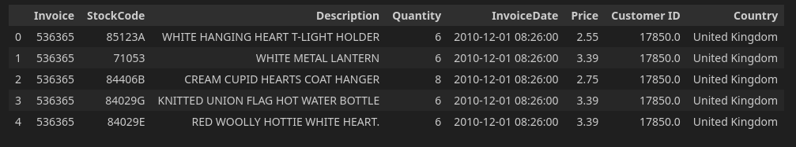
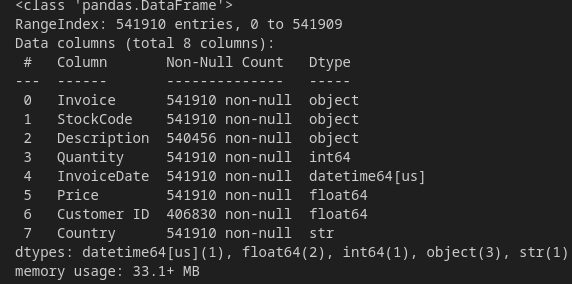
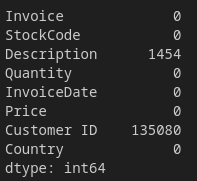
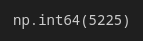
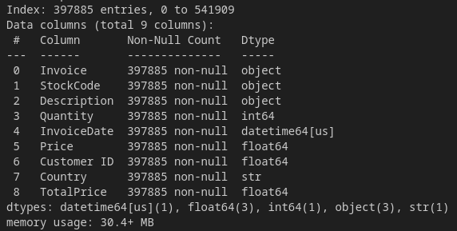
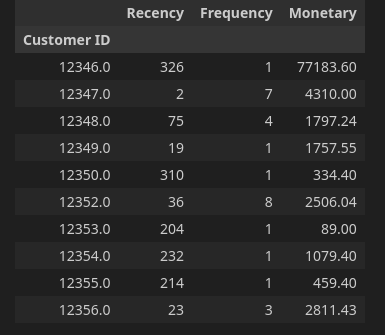
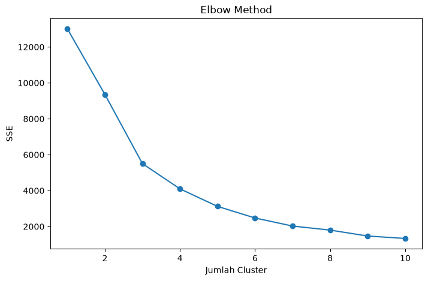
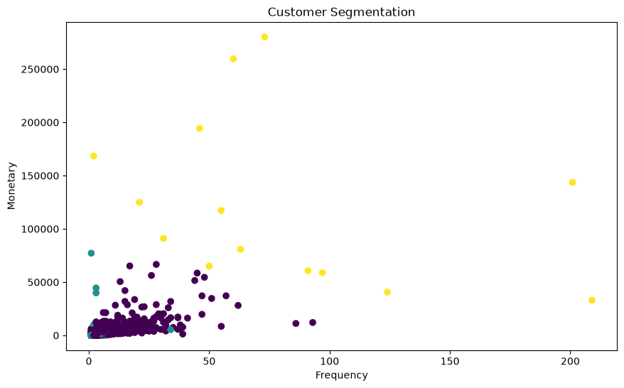

# PROYEK AKHIR
# PREPROCESSING DAN UNSUPERVISED LEARNING (CLUSTERING)

## Customer Segmentation Menggunakan Algoritma K-Means pada Dataset Online Retail II

---

## Disusun Oleh

**Nama :** Angga saputra

**NIM :** 241011401092

**Kelas :** 04TPLM007

**Mata Kuliah :** DATA MINING

**Program Studi :** Teknik Informatika

**Tahun :** 2026

---

# Daftar Isi

1. Pendahuluan
2. Deskripsi Dataset
3. Data Preprocessing
4. Feature Engineering
5. Implementasi Clustering
6. Evaluasi Model
7. Visualisasi Hasil
8. Kesimpulan
9. Daftar Pustaka

---

# BAB I
# PENDAHULUAN

## 1.1 Latar Belakang

Perkembangan teknologi informasi menghasilkan data transaksi dalam jumlah besar yang dapat dimanfaatkan untuk memperoleh informasi penting. Salah satu teknik dalam data mining adalah **clustering**, yaitu proses mengelompokkan data berdasarkan tingkat kemiripan tanpa menggunakan label.

Pada tugas ini saya  menggunakan dataset **Online Retail II** yang berisi data transaksi penjualan sebuah toko online. Dataset ini dipilih karena masih memiliki beberapa permasalahan seperti **missing value**, data duplikat, transaksi pembatalan, serta data yang tidak valid sehingga sesuai digunakan untuk proses preprocessing sebelum dilakukan clustering.

---

## 1.2 Tujuan

Tujuan dari proyek ini adalah:

- Melakukan preprocessing terhadap dataset.
- Membersihkan data agar siap dianalisis.
- Membentuk fitur yang dapat digunakan untuk clustering.
- Mengelompokkan pelanggan menggunakan algoritma K-Means.
- Mengevaluasi hasil clustering menggunakan Elbow Method dan Silhouette Score.

---

# BAB II
# DESKRIPSI DATASET

Dataset yang digunakan adalah **Online Retail II**.

Sumber Dataset:

https://www.kaggle.com/datasets/kabilan45/online-retail-ii-dataset?resource=download

Dataset berisi data transaksi penjualan dengan atribut sebagai berikut.

| Kolom | Keterangan |
|--------|------------|
| Invoice | Nomor transaksi |
| StockCode | Kode produk |
| Description | Nama produk |
| Quantity | Jumlah barang |
| InvoiceDate | Tanggal transaksi |
| Price | Harga produk |
| Customer ID | ID pelanggan |
| Country | Negara asal pelanggan |

Jumlah data awal:

- Baris : 541910 entries
- Kolom : 8 columns

## Contoh Dataset



**Gambar 2.1** Tampilan lima baris pertama dataset.

---

# BAB III
# DATA PREPROCESSING

Tahap preprocessing dilakukan agar data siap digunakan dalam proses clustering.

## 3.1 Identifikasi Dataset

Langkah pertama adalah melihat informasi dataset menggunakan fungsi:

```python
df.info()
```

Hasil yang diperoleh menunjukkan tipe data setiap atribut.



**Gambar 3.1** Informasi dataset.

---

## 3.2 Missing Value

Pengecekan missing value dilakukan menggunakan:

```python
df.isnull().sum()
```

Hasil menunjukkan terdapat missing value terutama pada kolom:

- Description
- Customer ID

Karena Customer ID diperlukan dalam proses segmentasi pelanggan, maka baris yang memiliki nilai kosong dihapus.

```python
df = df.dropna(subset=["Customer ID"])
df = df.dropna(subset=["Description"])
```



**Gambar 3.2** Missing value sebelum proses cleaning.

---

## 3.3 Data Duplikat

Selanjutnya dilakukan pengecekan data duplikat menggunakan:

```python
df.duplicated().sum()
```

Apabila ditemukan data yang sama, maka data tersebut dihapus.

```python
df = df.drop_duplicates()
```



**Gambar 3.3** Data duplikat sebelum di hilangkan.

---

## 3.4 Menghapus Data Tidak Valid

Dataset Online Retail memiliki transaksi pembatalan yang ditandai dengan huruf **C** pada nomor Invoice.

Contoh:

```
C536379
```

Transaksi tersebut dihapus menggunakan:

```python
df = df[~df["Invoice"].astype(str).str.startswith("C")]
```

Selain itu dilakukan juga penghapusan data dengan:

- Quantity ≤ 0
- Price ≤ 0

```python
df = df[df["Quantity"] > 0]
df = df[df["Price"] > 0]
```

Langkah ini dilakukan agar data yang digunakan hanya transaksi yang benar-benar valid.

---

## 3.5 Membuat Kolom TotalPrice

Nilai transaksi dihitung menggunakan rumus:

```
TotalPrice = Quantity × Price
```

Implementasi:

```python
df["TotalPrice"] = df["Quantity"] * df["Price"]
```

Contoh:

| Quantity | Price | TotalPrice |
|-----------|------:|-----------:|
| 6 | 2.55 | 15.30 |



**Gambar 3.4** Penambahan kolom TotalPrice.

---

# BAB IV
# FEATURE ENGINEERING

Pada penelitian ini digunakan metode **RFM (Recency, Frequency, Monetary)** untuk membentuk data pelanggan.

Penjelasan masing-masing atribut:

- **Recency** : Lama waktu sejak transaksi terakhir pelanggan.
- **Frequency** : Jumlah transaksi yang dilakukan pelanggan.
- **Monetary** : Total nilai transaksi pelanggan.

Pembentukan data RFM dilakukan menggunakan fungsi `groupby()`.

Hasil akhirnya menghasilkan dataset baru yang berisi satu baris untuk setiap pelanggan.

| Customer ID | Recency | Frequency | Monetary |
|--------------|---------:|----------:|----------:|



**Gambar 4.1** Dataset 10 pertama hasil Feature Engineering.

---

# BAB V
# IMPLEMENTASI CLUSTERING

Sebelum dilakukan clustering, data terlebih dahulu distandarisasi menggunakan **StandardScaler**.

```python
from sklearn.preprocessing import StandardScaler
```

Selanjutnya dilakukan penentuan jumlah cluster menggunakan **Elbow Method**.

Misalnya diperoleh titik siku pada:

```
K = 3
```

Maka proses clustering dilakukan menggunakan:

```python
KMeans(n_clusters=3)
```

Setiap pelanggan kemudian memperoleh label cluster.

---

# BAB VI
# EVALUASI MODEL

## 6.1 Elbow Method

Elbow Method digunakan untuk menentukan jumlah cluster terbaik.

Grafik berikut menunjukkan hubungan antara jumlah cluster dengan nilai SSE.



**Gambar 6.1** Grafik Elbow Method.

Berdasarkan grafik tersebut dipilih jumlah cluster yang menghasilkan titik siku sehingga diperoleh nilai **K = 3**.

---

## 6.2 Silhouette Score

Kualitas clustering dievaluasi menggunakan Silhouette Score.

Contoh:

```
Silhouette Score = 0.58
```

Semakin mendekati nilai 1 menunjukkan bahwa hasil clustering semakin baik.

---

# BAB VII
# VISUALISASI HASIL

Visualisasi dilakukan menggunakan Scatter Plot.

Sumbu X menggunakan **Frequency** sedangkan sumbu Y menggunakan **Monetary**.

Warna yang berbeda menunjukkan kelompok pelanggan yang berbeda.



**Gambar 7.1** Hasil K-Means Clustering.

---

## Analisis Cluster

### Cluster 0 Pelanggan Aktif

- Nilai Recency sebesar 40,98 hari, menunjukkan pelanggan masih cukup aktif melakukan transaksi.
- Nilai Frequency sebesar 4,85, artinya pelanggan telah melakukan pembelian beberapa kali.
- Nilai Monetary sebesar 2.005,84, menunjukkan total pengeluaran berada pada tingkat menengah.

Interpretasi:

Cluster 0 merupakan kelompok pelanggan aktif dengan frekuensi pembelian sedang dan nilai transaksi yang cukup baik. Kelompok ini memiliki potensi untuk ditingkatkan menjadi pelanggan loyal melalui program promosi atau pemberian reward.

### Cluster 1 Pelanggan Tidak Aktif

- Nilai Recency sebesar 246,02 hari, menunjukkan pelanggan sudah lama tidak melakukan transaksi.
- Nilai Frequency hanya 1,58, sehingga pelanggan sangat jarang melakukan pembelian.
- Nilai Frequency hanya 1,58, sehingga pelanggan sangat jarang melakukan pembelian.

Interpretasi:

Cluster 1 merupakan kelompok pelanggan tidak aktif (Inactive Customers). Pelanggan pada kelompok ini memiliki tingkat pembelian yang rendah dan sudah lama tidak bertransaksi. Strategi yang dapat dilakukan adalah memberikan promosi khusus atau program reaktivasi pelanggan.

### Cluster 2 Pelanggan VIP

- Nilai Recency sebesar 7,14 hari, menunjukkan pelanggan baru saja melakukan transaksi.
- Nilai Frequency mencapai 80,21, jauh lebih tinggi dibandingkan cluster lainnya.
- Nilai Monetary sebesar 122.748,79, merupakan nilai transaksi paling tinggi.

Interpretasi:

Cluster 2 merupakan kelompok pelanggan VIP atau pelanggan terbaik (High Value Customers). Pelanggan dalam cluster ini memiliki frekuensi pembelian yang sangat tinggi serta memberikan kontribusi pendapatan terbesar bagi perusahaan. Kelompok ini perlu dipertahankan dengan memberikan pelayanan eksklusif, program loyalitas, atau penawaran khusus.

---

# BAB VIII
# KESIMPULAN

Berdasarkan proses yang telah dilakukan dapat disimpulkan bahwa:

1. Dataset Online Retail II memerlukan preprocessing sebelum digunakan dalam proses clustering karena masih terdapat missing value, data duplikat, dan transaksi yang tidak valid.

2. Feature Engineering menggunakan metode RFM mampu mengubah data transaksi menjadi data pelanggan sehingga lebih sesuai untuk proses segmentasi.

3. Algoritma K-Means berhasil mengelompokkan pelanggan ke dalam beberapa cluster berdasarkan karakteristik transaksi.

4. Hasil evaluasi menggunakan Elbow Method dan Silhouette Score menunjukkan bahwa model clustering mampu membentuk kelompok pelanggan yang cukup baik.

5. Informasi hasil clustering dapat dimanfaatkan sebagai dasar dalam menentukan strategi pemasaran dan pelayanan pelanggan.

---

# DAFTAR PUSTAKA

Han, J., Kamber, M., & Pei, J. (2012). *Data Mining: Concepts and Techniques*. Morgan Kaufmann.

Pedregosa, F., et al. (2011). Scikit-Learn: Machine Learning in Python.

UCI Machine Learning Repository. Online Retail Dataset.

https://archive.ics.uci.edu/

Pandas Documentation.

https://pandas.pydata.org/

Scikit-Learn Documentation.

https://scikit-learn.org/